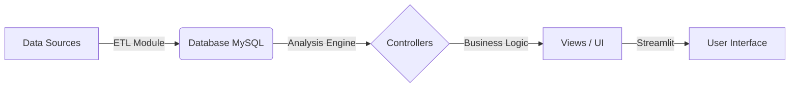

# 📘 FiinQuantX - Developer Guide

> **Mục tiêu:** Hệ thống phân tích chứng khoán Việt Nam, hỗ trợ backtest, theo dõi dòng tiền và khuyến nghị đầu tư.
> **Đối tượng đọc:** Developers, Data Analysts muốn đóng góp hoặc bảo trì hệ thống.

---

## 1. 🏗️ Kiến trúc Hệ thống (Architecture)

Hệ thống hoạt động theo luồng dữ liệu một chiều (Unidirectional Data Flow):



1.  **ETL Layer (`/etl`):** Chịu trách nhiệm cào dữ liệu (Price, Fundamental, Flow) và lưu vào DB.
2.  **Storage Layer (`/database`):** Quản lý Schema, kết nối và các script maintenance DB.
3.  **Core Logic (`/analysis`):** "Bộ não" tính toán chỉ báo, chấm điểm, backtest, tín hiệu mua bán.
4.  **Presentation Layer (`/views` & `/controllers`):** Tổ chức dữ liệu để hiển thị lên Streamlit.

---

## 2. 📂 Bản đồ Dự án (Directory Map)

Để tìm đúng file cần sửa, hãy tra cứu bản đồ này:

### 🔄 ETL & Data Pipeline (`/etl`)
Nơi xử lý đầu vào dữ liệu. Chạy định kỳ để cập nhật DB.
*   `runner.py`: Script chính để chạy toàn bộ quy trình cập nhật dữ liệu hàng ngày.
*   `flow.py`, `price.py`, `fundamental.py`: Các module tải dữ liệu chuyên biệt.
*   `base.py`: Class cha chứa các hàm chung (retry, logging, connection).

### 🗄️ Database Management (`/database`)
*   `setup.py`: Script khởi tạo bảng (Create Table). Chạy 1 lần đầu tiên.
*   `check_*.py`: Các script tiện ích để kiểm tra sức khỏe dữ liệu (check size, check missing data).

### 🧠 Analysis Engine (`/analysis`)
Đây là nơi chứa toán học và thuật toán tài chính.
*   `market/`: Các chỉ báo vĩ mô thị trường (Độ rộng, Thanh khoản, Xu hướng index).
*   `signal_engine/`: Bộ lọc cổ phiếu (Scanner), Backtest tín hiệu và Gửi cảnh báo (Discord).
*   `core.py`, `technical.py`, `fundamental.py`: Thư viện tính toán chỉ số (RSI, MACD, PE, PB...).

### 🖥️ Application Layer (`/controllers` & `/views`)
*   `controllers/`: Nhận request từ UI -> Gọi Analysis lấy số liệu -> Trả về DataFrame sạch sẽ.
*   `views/`: Nhận DataFrame từ Controller -> Vẽ biểu đồ (Plotly) -> Hiển thị lên Streamlit (`st.dataframe`, `st.plotly_chart`).
*   `app.py`: File chạy chính, điều hướng các trang.

---

## 3. 🛠️ Hướng dẫn Bảo trì & Phát triển (Playbook)

Phần quan trọng nhất để bạn và đồng đội biết **phải sửa ở đâu**.

### 🟢 Kịch bản 1: Thêm một chỉ báo kỹ thuật mới (VD: Bollinger Bands)
1.  **Bước 1 (Logic):** Vào `analysis/technical.py`, viết hàm tính toán `calculate_bollinger()`.
2.  **Bước 2 (Controller):** Vào `controllers/stock_controller.py`, gọi hàm đó để thêm cột vào DataFrame giá.
3.  **Bước 3 (UI):** Vào `views/stock_view.py`, thêm code vẽ biểu đồ (add trace) cho Bollinger Bands.

### 🟡 Kịch bản 2: Dữ liệu bị lỗi hoặc thiếu
1.  Chạy `database/check_flow_status.py` hoặc `check_size.py` để xem bảng nào bị hổng dữ liệu.
2.  Nếu cần tải lại, dùng `etl/on_demand.py` (nếu có) hoặc chỉnh sửa ngày trong `etl/runner.py` để chạy lại dữ liệu quá khứ.

### 🔴 Kịch bản 3: Sửa lỗi hiển thị trên Dashboard
1.  Kiểm tra `app/dashboard.py` hoặc `views/market_view.py`.
2.  Các logic tính toán số liệu tổng hợp thường nằm ở `analysis/market/trend.py`.

---

## 4. 🚀 Quy trình Setup cho thành viên mới

1.  **Clone & Environment:**
    ```bash
    git clone <repo_url>
    python -m venv venv
    source venv/bin/activate  # Windows: venv\Scripts\activate
    pip install -r requirements.txt
    ```

2.  **Database Configuration:**
    *   Tạo file `.streamlit/secrets.toml` chứa thông tin DB (host, user, password).
    *   Nếu chưa có data: Chạy `database/setup.py` -> Chạy `etl/runner.py` (sẽ mất thời gian để tải full lịch sử).

3.  **Run App:**
    ```bash
    streamlit run app.py
    ```

---

## 5. 📝 Quy tắc Code (Coding Convention)

Để code sạch và dễ đọc chung:
*   **Type Hinting:** Bắt buộc dùng type hint.
    *   *Tệ:* `def get_price(symbol):`
    *   *Tốt:* `def get_price(symbol: str) -> pd.DataFrame:`
*   **Không Hardcode:** Mật khẩu DB để trong `secrets.toml`. Các tham số (như chu kỳ RSI=14) nên để thành hằng số hoặc config.
*   **Clean Up:** Xóa các file `copy.py` hoặc `check_connect.py` trước khi commit nếu không cần thiết.

---